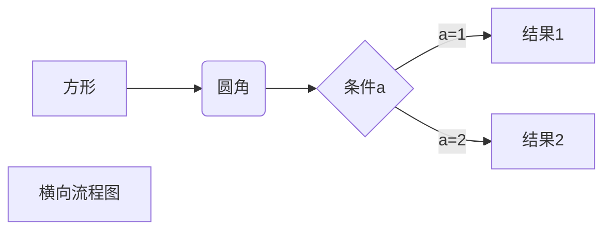
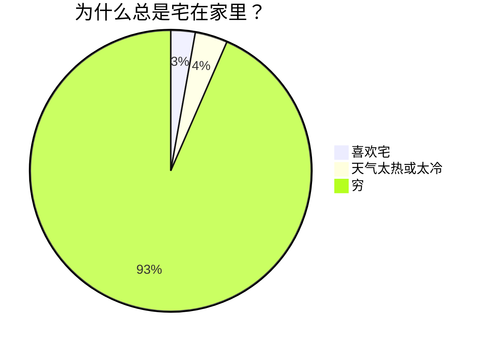

说到底，还是把握不住精髓。  
都是知道了该怎么做就开始抽象。而不是知道了为什么这么做再开始抽象。浮躁。 


# Markdown

## 换行、段落
> 换行：两个空格
> 段落： 一行空行

## 粗体、斜体
``` 
 ** text ** 
  * text * 
```
> **note** : *注意markdown中的符号后面的空格*

## 列表
```
1. xxx
2. xxx
3. xxx
```

## 链接、图片

```
链接[source](link "description")
图片 
```

## 转义字符 '\\'

## 表格
```
| 左对齐 | 右对齐 | 居中对齐 |
| :-----| ----: | :----: |
| 单元格 | 单元格 | 单元格 |
| 单元格 | 单元格 | 单元格 |
```
单元格合并 ：  
属于markdown扩展语法，需要markdown渲染器的支持，不支持没效果，记录一下，万一以后支持呢。
```
> 或 空 ： 横向框合并
^ : 纵向框合并
```
表格工具： [点击试用](https://kz16.top/ckeditor/)

## 代码

> 行内插入代码 ： \` code \`
> 多行代码：
> - \`\`\` code  \`\`\`
> - 四个空格或者tab缩进

代码进行语法高亮
>\`\`\` python  
> python code
>\`\`\`  

即在\`\`\`后标明 code的语言  

## Emoji

` :joy: ` 

示例： 这是开心的表情 :joy:    
如果上面没有出现表情，说明渲染器不支持emoji的渲染。需要安装额外插件
更多表情简码列表，[点击这里](https://gist.github.com/rxaviers/7360908)

## 改变字体颜色

markdown不支持改变字体颜色，但是支持html语法  
通过`<font color=green size=7 face="黑体"> font </font>`

## 公式
```
$公式$  #行内插入
$$公式$$ # 单独一行
```
$$ f(x)=sin(x)$$
如果上述公式看不到效果，检查markdown编辑器或者渲染插件是否安装了math插件。

公式工具：[点击使用](https://kz16.top/latex/symbol/)
公式速查：

## flowchart
能看到flowchart的前提是有解析工具，比如 markdown preview插件，提前生成，才能看到
hexo主题需要额外安装flowchart插件以支持渲染。

markdown图表类型支持： 流程图(mermaid/flow)、时序图(sequence)、甘特图(mermaid) 
语法：(需要在开头注明mermaid类型,此处被自动省略)
```
st=>start: 开始框
op=>operation: 处理框
cond=>condition: 判断框(是或否?)
sub1=>subroutine: 子流程
io=>inputoutput: 输入输出框
e=>end: 结束框
st(right)->op(right)->cond
cond(yes)->io(bottom)->e
cond(no)->sub1(right)->op
```
可以看出语法繁琐，记得很多。
下面是mermaid插件提供的语法
```
graph LR
A[方形] -->B(圆角)
    B --> C{条件a}
    C -->|a=1| D[结果1]
    C -->|a=2| E[结果2]
    F[横向流程图]
```
更多：   
[用mermaid画图](https://zhuanlan.zhihu.com/p/355997933)

效果:




# ***reference***

其他的汇总： 
 - [官方docs](https://markdown.com.cn/)
 - [终极教程](https://kz16.top/md/#markdown%E7%BB%88%E6%9E%81%E6%95%99%E7%A8%8B)
 - [runnoob菜鸟教程高级技巧](https://www.runoob.com/markdown/md-advance.html)
 

 中国人很擅长抽象， 化繁为简是好事，但总会丢了灵魂 