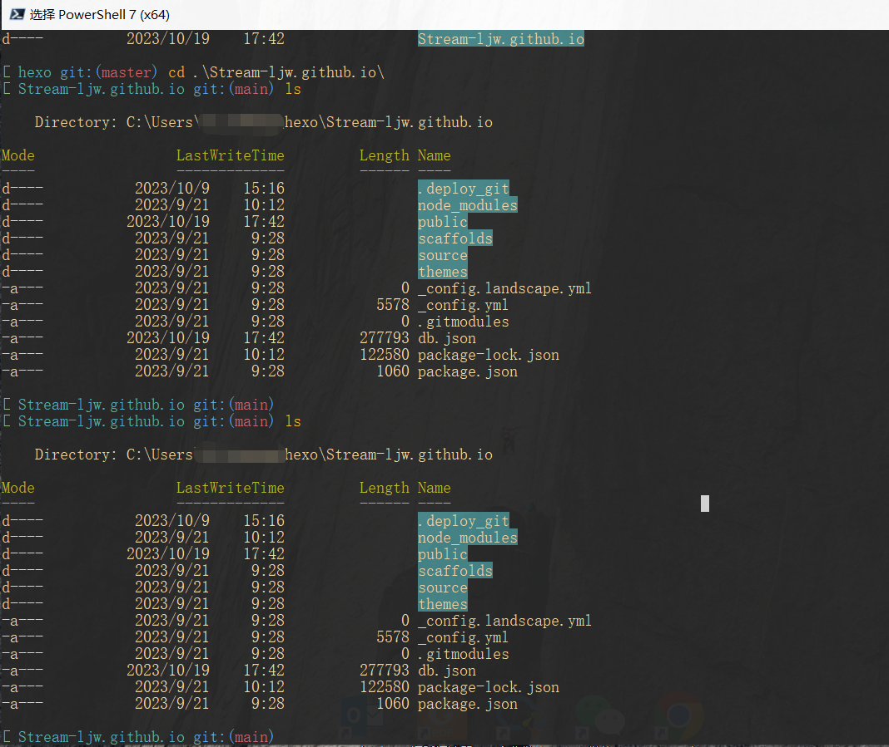

# powershell 美化方案

powershell是windows系统自带的命令行解释器，相比于默认的cmd，有着更友好的输入体验。  
但是对于经常使用的日常来说，powershell还是没有linux-shell那般很好的交互感和外观。

所以今天花了点时间美化一下。
widnows版本： win10



## 更换powershell7
---

powershell plus进阶版，甚至支持显示历史记录命令的功能，比powershell（以下称 **“posh”** ）又是上一个台阶。主要是还可以可以DIY。  

> 微软商店也有一款windows terminal，类似于win11系统里自带的cmd。只支持在设置里改配色，不支持插件改，同样不能更改主题。  
> 自带的默认的cmd就不说了，懂得都懂。

1. 所以在接下来美化开始之前，先安装PowerShell-7.3.8-win-x64.msi：[点此进入github仓库](https://github.com/PowerShell/PowerShell/releases)

## 更改配色 - Colortool
---

:point_right: [官方README](https://github.com/microsoft/terminal/tree/1904.29002)

1.  **安装 - win10**

[下载压缩包，然后解压](https://github.com/microsoft/terminal/releases/tag/1904.29002)  

> 解压缩的目录下面打开命令行（或者把解压缩的目录加入到 PATH 环境变量中）

2.  **使用**
  
配色库：[iTerm2-Color-Schemes](https://github.com/mbadolato/iTerm2-Color-Schemes)

下载 iTerm2-Color-Schemes/schemes/ 目录下的*.itermclors 配色文件 至 `colortool/schemes/` 目录下

通过 `Colortool.exe -s` 就可以列出所有的包含新增的主题列表了。

```
# 更改主题
Colortool.exe -b <Theme>
# 将主题设置为默认主题
Colortool.exe -d <Theme> 
```

> 在colortool/schemes/ 目录下，我们可以看到，同样支持 .ini 格式的主题文件

## 更改主题 - Oh-my-posh
------

1. 打开posh7 输入如下命令来安装 **Oh-my-posh** ： 

```powershell
Set-ExecutionPolicy Bypass -Scope Process -Force; Invoke-Expression ((New-Object System.Net.WebClient).DownloadString('https://ohmyposh.dev/install.ps1'))
```

2. 更改配置文件以达到每次打开posh都生效：（没有则会跳出来新建的弹窗，点击创建即可）

```powershell
notepad $PROFILE
```

3. 增加一行：   

```powershell
# 将命令中的 <Theme> 替换为你想要更换的主题名称
oh-my-posh init pwsh --config 'C:/Users/Posh/<Theme>.omp.json' | Invoke-Expression
```

获取Oh-my-posh支持的主题 ： `Get-PoshThemes` 这个命令会罗列很多很多主题

通过以上方式部署的主题已经默认支持git的显示了。
如果没有显示可以通过以下方式安装`Git-posh`` : 

```powershell
Install-Module posh-git -Scope CurrentUser 
```

通过 `Install-Module oh-my-posh -Scope CurrentUser` 安装 Oh-my-posh , 2023-10-19 亲测已经不适用  
但不代表Oh-my-posh不支持powershell了， 最新请参照[**官方文档**](https://ohmyposh.dev/docs/installation/windows)进行windows安装


## 更换字体
---

- 简单

右击状态栏--> 属性 --> 字体

- 添加字体
（暂无需求，有需求再更新）

# reference
---

- [Colortool.exe README](https://github.com/microsoft/terminal/tree/1904.29002)
- [Oh-my-posh 官方文档](https://ohmyposh.dev/docs/themes)