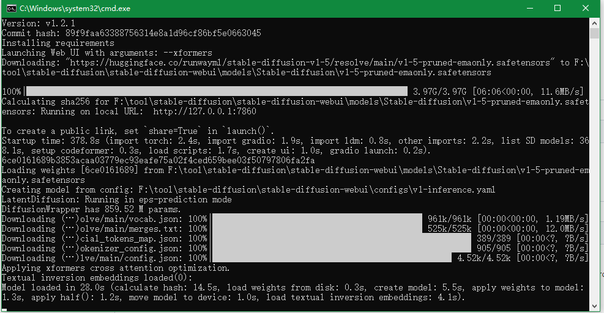
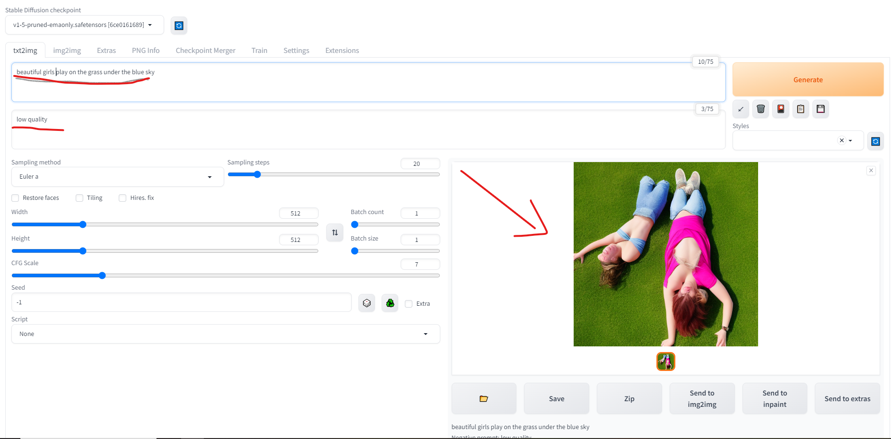

# History
为什么可以从文字输出图像？
首先得复习一下机器学习。
## Relate
当下ai绘画主流产品：MidJourney ，stable-diffusion， DALL·E

   产品          | 特点 | 共同点
   ---           | ---  | ---
MidJourney       |  收费 | 三款产品都是可以根据text形式prompt(提示词)来生成图片也可以根据图片来修改。
DALL-E           | openai 产品之一，著名的是其语言模型gpt-4 ，ofcourse，收费。| ^
stable-diffusion | 开源免费，适合商用  | ^

## Requisite
- 潜空间

- UNet神经网络

- 调度算法Scheduling

- 扩散diffusion

- 生成过程


------------

# 使用
参数            |   说明
 :---:          |    :-:
Prompt          |    提示词（正向）
Negative prompt	| 消极的提示词（反向）
Width & Height	|要生成的图片尺寸。尺寸越大，越耗性能，耗时越久。
CFG scale       |	AI 对描述参数（Prompt）的倾向程度。值越小生成的图片越偏离你的描述，但越符合逻辑；值越大则生成的图片越符合你的描述，但可能不符合逻辑。
Sampling method	| 采样方法。有很多种，但只是采样算法上有差别，没有好坏之分，选用适合的即可。
Sampling steps	|采样步长。太小的话采样的随机性会很高，太大的话采样的效率会很低，拒绝概率高(可以理解为没有采样到,采样的结果被舍弃了)。
Seed	        | 随机数种子。生成每张图片时的随机种子，这个种子是用来作为确定扩散初始状态的基础。不懂的话，用随机的即可。

## env build - windows
click here :point_right: [official guidance of source code](https://github.com/AUTOMATIC1111/stable-diffusion-webui)
- 写在前面的tips
**请确保显卡驱动更新+ 更改pip源 + git配置，这样安装过程才会一帆风顺**
	+ `更新venv目录下的 pip版本`或`pip下载库connect timeout`常见问题:  
		` -i https://pypi.tuna.tsinghua.edu.cn/simple `   
		或 修改`pip.ini` (`C:\Users\name\AppData\Roaming\pip\pip.ini`)：
		```
		[global]
			index-url = https://pypi.tuna.tsinghua.edu.cn/simple
		```
	+ git添加代理
		- 飞机场用户 
			1. 到飞机场设置中查看本地监听端口 
			2. `git config --global http.proxy socks5://127.0.0.1:[port] #git全局设置`
		-  VPN用户
			1. 端口是配置vpn是设置的本地监听端口
			2. `git config --global http.https://github.com.proxy socks5://127.0.0.1:[port] #专门给github设置`

1. 全自动安装包 :point_right: [详细的指南(包括支持AMD显卡)](https://nerdschalk.com/install-stable-diffusion-windows/)  
2. manually install： (先犯错，再总结) 
```	
# prepare `python3.10.6(更新的版本不支持torch)+git`
git clone https://github.com/AUTOMATIC1111/stable-diffusion-webui.git
# 更改pip源 + git配置代理（如果没有使用vpn，按照下述，修改目录下launch.py）
# 修改 webui-user.bat :  set COMMANDLINE_ARGS=--xformers --no-gradio-queue
# run webui-user.bat  #不需要管理员权限运行
# #重新安装basisr (下列都可省略，如果出现对应错误情况下)
# #run webui-user.bat
# 等待下载好模型
```
3. 完成安装! 本地浏览器进入 `localhost:7860` 或`127.0.0.1:7860`

### **Trouble Shooting**  
- `Torch is not able to use GPU`
	+ 尝试更新显卡驱动
		官网下载最新驱动 :point_right: [链接](https://www.nvidia.in/Download/index.aspx?lang=en)    
	+ 更新后删除或重命名stable-diffusion/venv目录
	+ 重新执行webui-user.bat

- `RuntimeError: Couldn't install gfpgan.`
如果一开始遇到pip install慢或者失败问题，建议按上述修改`pip.ini`。
根本原因是与github连接网络不稳定，小飞机虽然有点用，但全局模式用处不大，可能会成功，但是龟速+失败多，还是建议以下方式：  
	+ 方法1 ： :point_right: [resulotion](https://github.com/CompVis/stable-diffusion/issues/506#issuecomment-1438585062)
	将launch.py 中 `https://github.com/`替换为 `https://ghproxy.com/https://github.com/`
	+ 方法2 ： 给git添加代理
	
- `No module 'xformers'. Proceeding without it.`
缺啥补啥，在webui-user.bat里 `set COMMANDLINE_ARGS=--xformers `    

关于 xformers : :point_right:[xformers github page](https://github.com/AUTOMATIC1111/stable-diffusion-webui/wiki/Xformers)
简而言之, xformers可以加速图像生成速度,减少VRAM使用, 2023.1.23之前都是需要用户手动安装的,之后**AUTOMATIC111**版本的webui  
集成了自动安装xformers,但是需要再启动command里添加 --xformers以激活该功能.

- `ModuleNotFoundError: No module named 'basicsr.version`
:point_right:[solution](https://github.com/AUTOMATIC1111/stable-diffusion-webui/issues/1598#issuecomment-1501010130)
重新安装basicsr  
*该错误根本原因是python库里面没有basicsr库，这个肯定是安装的，就是用的时候没有。  
由此可以想到，这是本地环境有问题，而非工程问题。应该是没有装到正确的地方。这个问题大部分情况不会出现，因为本人电脑上装过的python太多。  没有其他的裸机去验证。暂时就这样吧。*

- 打开后输入prompts时网页右上角显示: `Something went wrong Expecting value: line 1 column 1 (char 0)`,且运行出错
:point_right:[solution](https://github.com/AUTOMATIC1111/stable-diffusion-webui/issues/9132#issuecomment-1488840066)
`set COMMANDLINE_ARGS=--xformers --no-gradio-queue`
stable-diffusion支持生成gradio链接, 目的是可以在其他设备也可以访问该服务. 如果本地开了vpn代理,则无法生成.
方式就是关闭代理,或禁用gradio生成.

## env build - linux
```
	sudo apt install wget git python3 python3-venv
	bash <(wget -qO- https://raw.githubusercontent.com/AUTOMATIC1111/stable-diffusion-webui/master/webui.sh)
	sh webui.sh
	#check webui-user.sh for options
```

## env build - 服务器上通过接口调用

## use-case

上面图片就是我刚进入网页时随便输入一段话然后生成的结果. 简直...不堪入目 :scream: :scream::scream::scream:!!!!

如何进行改善呢?    
影响图像效果的因素： `参数，模型，prompt`
先来熟悉stable-diffusion-webui上面的一些模式
- text2img

- text+img2img
:point_right:[几种模式的解释](https://blog.51cto.com/tinygeeker/6185988)  
以下仅作为巩固记录：  
参数 | 解释
  -  |  -
resize mode | 依此是：`拉抻`，`裁剪`，`填充`，`仅调整大小`，缩放模式指的是当原图和要生成的图的宽和高不一致的时候，选择的缩放模式，一般选择裁剪，如果原图和生成图的宽高一致的时候，选择任意均可

一些工具，可能以后会用到： 
- :point_right:[controlNet 工具](https://vocus.cc/article/640ee135fd8978000155ef23)  

---------
# 应用--换装预览

## Scenario 1：
淘宝商家给出衣服图片，用ai绘出穿着衣服的人物模型，支持各种场景和人物姿势.  
:point_right:[**AI models**样例](https://www.zmo.ai/aimodels/)
- Details
1. 随机模特模型生成
2. 提供的照片衣服模型结合

## Scenario 2：
消费者网购衣服，需要预览选中的衣服的效果，不同场合，不同姿势。
- Details
1. 消费者人物模型生成
2. 选取衣服模型提取

## Thread
如何生成不同的models？（训练，）
生成的models如何与图片中的衣服结合？

1. client
选择衣服，选择预览人物
2. server
根据所选衣服和预览人物，生成提示词，填入后调接口进行生成
3. 生成提示词精准度
4. 提高生成速度

# Implement
(待续)

--------
# ***reference***
- 模型下载 :point_right: [点此进入](https://civitai.com/)
- 我从这篇简单的入门 :point_right: [点此学习](https://zhuanlan.zhihu.com/p/610094594?utm_id=0)
- :point_right: [wiki是一个很棒的学习方式](https://zh.wikipedia.org/zh-cn/Stable_Diffusion)
- 好玩的AI社区：[这是stable-diffusion的一个样例, 还有例如chatgpt-4的体验空间](https://huggingface.co/spaces/stabilityai/stable-diffusion)

- 一些教程: 
	[湾湾的教程](https://github.com/ivon852/netlify-ivon-blog-comments/discussions/437)  
	
"Do one thing every day that scares you." --Eleanor Roosevelt