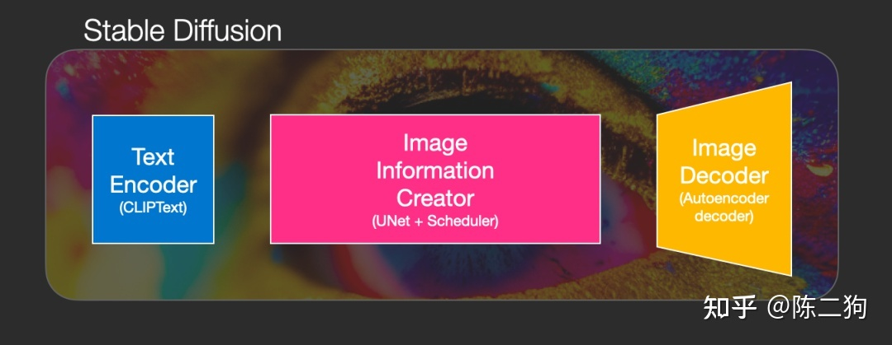

# stable diffusion

## History
当下ai绘画主流产品：MidJourney ，stable-diffusion， DALL·E

   产品          | 特点 | 共同点
   ---           | ---  | ---
MidJourney       |  收费 | 三款产品都是可以根据text形式prompt(提示词)来生成图片也可以根据图片来修改。
DALL-E           | openai 产品之一，著名的是其语言模型gpt-4 ，ofcourse，收费。| ^
stable-diffusion | 开源免费，适合商用  | ^

## Requisite
- 潜空间

- UNet神经网络

- 调度算法Scheduling

- 扩散diffusion

- 生成过程


------------

# 使用
参数            |   说明
 :---:          |    :-:
Prompt          |    提示词（正向）
Negative prompt	| 消极的提示词（反向）
Width & Height	|要生成的图片尺寸。尺寸越大，越耗性能，耗时越久。
CFG scale       |	AI 对描述参数（Prompt）的倾向程度。值越小生成的图片越偏离你的描述，但越符合逻辑；值越大则生成的图片越符合你的描述，但可能不符合逻辑。
Sampling method	| 采样方法。有很多种，但只是采样算法上有差别，没有好坏之分，选用适合的即可。
Sampling steps	|采样步长。太小的话采样的随机性会很高，太大的话采样的效率会很低，拒绝概率高(可以理解为没有采样到,采样的结果被舍弃了)。
Seed	        | 随机数种子。生成每张图片时的随机种子，这个种子是用来作为确定扩散初始状态的基础。不懂的话，用随机的即可。

## env build
click here :point_right: [official guidance of source code](https://github.com/AUTOMATIC1111/stable-diffusion-webui)
- 本地环境搭建webui
	1. **windows:**
	:point_right: [详细的指南(包括支持AMD显卡)](https://nerdschalk.com/install-stable-diffusion-windows/)  
	manually install：
	```	
		#prepare `python3.10.6(更新的版本不支持torch)+git`
		git clone https://github.com/AUTOMATIC1111/stable-diffusion-webui.git
		#run webui-user.bat  #不需要管理员权限运行
	```
	- 安装失败： `Torch is not able to use GPU`
		+ 尝试更新显卡驱动
			官网下载最新驱动 :point_right: [链接](https://www.nvidia.in/Download/index.aspx?lang=en)  
			解压后开始安装  
		+ 更新后删除或重命名stable-diffusion/venv目录
		+ 重新执行webui-user.bat
			`更新venv目录下的 pip版本`或`pip下载库connect timeout`常见问题:  
			` -i https://pypi.tuna.tsinghua.edu.cn/simple `
	- `RuntimeError: Couldn't install gfpgan.`
		+ 方法1 ： :point_right: [resulotion](https://github.com/CompVis/stable-diffusion/issues/506#issuecomment-1438585062)
		+ 方法2 ： 给git添加代理
		+ 方法3 ： 更换pip源： 更改pip.ini(`C:\Users\name\AppData\Roaming\pip\pip.ini`)
		```
		[global]
			index-url = https://pypi.tuna.tsinghua.edu.cn/simple
		```
		重新运行 webui-user.bat （等待很长时间，可能电脑太菜~ ）
	2. **linux:**
	```
		sudo apt install wget git python3 python3-venv
		bash <(wget -qO- https://raw.githubusercontent.com/AUTOMATIC1111/stable-diffusion-webui/master/webui.sh)
		sh webui.sh
		#check webui-user.sh for options
	```

- **如何在服务器上通过接口调用服务**

## use-case
影响图像效果的因素： `参数，模型，prompt`
- text2img

- text+img2img

---------
# 应用--换装预览

## Scenario 1：
淘宝商家给出衣服图片，用ai绘出穿着衣服的人物模型，支持各种场景和人物姿势.  
:point_right:[**AI models**样例](https://www.zmo.ai/aimodels/)
### Details
1. 随机模特模型生成
2. 提供的照片衣服模型结合

## Scenario 2：
消费者网购衣服，需要预览选中的衣服的效果，不同场合，不同姿势。
### Details
1. 消费者人物模型生成
2. 选取衣服模型提取

## Thread
1. client
选择衣服，选择预览人物
2. server
根据所选衣服和预览人物，生成提示词，填入后调接口进行生成

3. 生成提示词精准度
4. 提高生成速度


# Implement
(待续)

--------
# ***reference***
- 模型下载 :point_right: [点此进入](https://civitai.com/)
- 我从这篇简单的入门 :point_right: [点此学习](https://zhuanlan.zhihu.com/p/610094594?utm_id=0)
- :point_right: [wiki是一个很棒的学习方式](https://zh.wikipedia.org/zh-cn/Stable_Diffusion)
- 好玩的AI社区：[这是stable-diffusion的一个样例, 还有例如chatgpt-4的体验空间](https://huggingface.co/spaces/stabilityai/stable-diffusion)


"Do one thing every day that scares you." --Eleanor Roosevelt